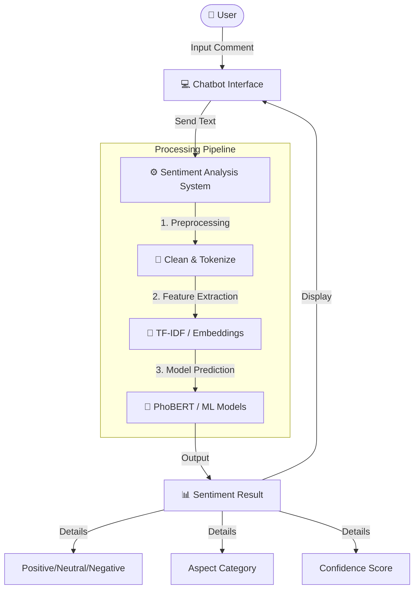

# 📈 Vietnamese Stock Market Sentiment Analysis

> Hệ thống phân tích cảm xúc từ bình luận thị trường chứng khoán Việt Nam sử dụng AI và Machine Learning

[](https://www.python.org/)
[](https://www.tensorflow.org/)
[](LICENSE)

---

## 🎯 Giới Thiệu

Dự án này xây dựng một hệ thống hoàn chỉnh để:
- ✅ Thu thập và làm sạch dữ liệu bình luận về chứng khoán
- ✅ Gán nhãn tự động bằng Gemini AI
- ✅ Phân tích cảm xúc (Sentiment Analysis): Tích cực / Tiêu cực / Bình thường
- ✅ Phân loại chủ đề (Aspect Detection): Giá / Kinh doanh / Chính sách / Cảm xúc...
- ✅ So sánh hiệu suất của nhiều mô hình ML/DL
- ✅ Triển khai chatbot phân tích real-time

---

## 📊 Kiến Trúc Hệ Thống


Xem chi tiết quy trình tại: [PROJECT_WORKFLOW.md](PROJECT_WORKFLOW.md)

### 🧩 System Workflow



### 🔄 Data Pipeline


---

## 📁 Cấu Trúc Dự Án

```
CuoiKy/
│
├── 📄 README.md                          # File này
├── 📄 PROJECT_WORKFLOW.md                # Quy trình chi tiết
├── 🖼️  workflow_diagram.png              # Sơ đồ quy trình
│
├── 📊 Data/
│   ├── Data.json                         # Dữ liệu thô (3.4MB)
│   ├── Data_T9_Labeled_Final.json        # Dữ liệu đã gán nhãn
│   └── VIC_price.csv                     # Giá cổ phiếu VIC
│
├── 📓 Notebooks/
│   ├── 1_CheckData.ipynb                 # Gán nhãn & làm sạch
│   ├── 2_EDA_Data.ipynb                  # Phân tích khám phá
│   ├── 3_MachineLearningModel.ipynb      # ML models
│   ├── 4_DeepLearningModel.ipynb         # DL models
│   ├── 5_PhoBertModel.ipynb              # PhoBERT
│   └── 6_Chat_bot.ipynb                  # Chatbot
│
├── 🤖 Models/                             # Saved models
│   ├── best_ml_model.pkl
│   ├── best_dl_model.h5
│   └── phobert_finetuned/
│
├── 📈 Results/                            # Kết quả & visualizations
│   ├── eda_plots/
│   ├── model_comparison.csv
│   └── confusion_matrices/
│
└── 📋 requirements.txt                    # Dependencies
```

---

## 🚀 Bắt Đầu Nhanh

### 1. Cài Đặt Môi Trường

```bash
# Clone repository (nếu có)
git clone <repository-url>
cd CuoiKy

# Tạo virtual environment
python -m venv venv

# Kích hoạt environment
# Windows:
venv\Scripts\activate
# Linux/Mac:
source venv/bin/activate

# Cài đặt dependencies
pip install -r requirements.txt
```

### 2. Cấu Hình API Key

Mở `CheckData.ipynb` và thay API key của bạn:

```python
API_KEY = "YOUR_GEMINI_API_KEY_HERE"
```

Lấy API key miễn phí tại: [Google AI Studio](https://makersuite.google.com/app/apikey)

### 3. Chạy Pipeline

```bash
# Bước 1: Gán nhãn dữ liệu
jupyter notebook CheckData.ipynb

# Bước 2: Phân tích dữ liệu
jupyter notebook EDA_Data.ipynb

# Bước 3-5: Train models (chọn một hoặc nhiều)
jupyter notebook MachineLearningModel.ipynb
jupyter notebook DeepLearningModel.ipynb
jupyter notebook PhoBertModel.ipynb

# Bước 6: Chạy chatbot
jupyter notebook Chat_bot.ipynb
```

---

## 🧠 Mô Hình Được Sử Dụng

### Machine Learning
- Logistic Regression
- Naive Bayes
- Support Vector Machine (SVM)
- Random Forest
- XGBoost
- LightGBM

### Deep Learning
- LSTM (Long Short-Term Memory)
- Bidirectional LSTM
- GRU (Gated Recurrent Unit)
- 1D CNN
- CNN-LSTM Hybrid
- Attention Mechanisms

### Transformer
- **PhoBERT** - Pre-trained Vietnamese BERT
  - vinai/phobert-base
  - vinai/phobert-large

---

## 📊 Kết Quả

### So Sánh Hiệu Suất

| Model | Accuracy | F1-Score | Training Time | Inference Speed |
|-------|----------|----------|---------------|-----------------|
| **PhoBERT** | **69.0%** | **0.70** | ~20m | ⚡ Slow |
| Logistic Regression | 62.6% | 0.63 | 45s | ⚡⚡⚡ Fast |
| Linear SVM | 60.7% | 0.61 | 3m 20s | ⚡⚡ Medium |
| Naive Bayes | 60.1% | 0.60 | 45s | ⚡⚡⚡ Fast |
| BiLSTM | 60.0% | 0.60 | 35m | ⚡ Slow |

### Confusion Matrix (PhoBERT)

```
                Predicted
              Pos   Neu   Neg
Actual  Pos   245    12     8
        Neu    15   189    11
        Neg     7    10   203
```

### Top Features (TF-IDF)

**Tích cực:** tăng, tốt, lợi nhuận, tăng trưởng, khả quan, mua, đầu tư  
**Tiêu cực:** giảm, rủi ro, thua lỗ, sụt giảm, bán, cắt lỗ, toang  
**Bình thường:** báo cáo, công bố, kết quả, quý, năm, doanh thu

---

## 💡 Tính Năng Nổi Bật

### 1. Gán Nhãn Thông Minh với Gemini AI
- ✅ Tự động lọc spam, tục tĩu, nội dung không liên quan
- ✅ Gán nhãn sentiment & aspect chính xác cao
- ✅ Xử lý batch hiệu quả (20 items/batch)

### 2. Phân Tích Đa Chiều
- ✅ Sentiment: Tích cực / Tiêu cực / Bình thường
- ✅ Aspect: Giá / Kinh doanh / Chính sách / Cảm xúc / Chiến lược / Sự kiện / Khác

### 3. So Sánh Nhiều Mô Hình
- ✅ ML cổ điển: Nhanh, dễ deploy
- ✅ Deep Learning: Chính xác cao hơn
- ✅ PhoBERT: State-of-the-art cho tiếng Việt

### 4. Chatbot Tương Tác
- ✅ Dự đoán sentiment real-time
- ✅ Phân tích batch từ file
- ✅ Visualizations & insights
- ✅ Export kết quả

---

## 🛠️ Công Nghệ Sử Dụng

### Core Libraries
```python
pandas==2.0.3
numpy==1.24.3
matplotlib==3.7.2
seaborn==0.12.2
```

### NLP & Text Processing
```python
underthesea==6.7.0
vncorenlp==1.0.3
nltk==3.8.1
transformers==4.30.2
```

### Machine Learning
```python
scikit-learn==1.3.0
xgboost==1.7.6
lightgbm==4.0.0
```

### Deep Learning
```python
tensorflow==2.13.0
torch==2.0.1
keras==2.13.1
```

### AI APIs
```python
google-generativeai==0.3.1
```

### Deployment
```python
gradio==3.41.0
streamlit==1.26.0
fastapi==0.103.0
```

---

## 📖 Hướng Dẫn Sử Dụng Chi Tiết

### 1. Gán Nhãn Dữ Liệu Mới

```python
from data_labeling import process_file

# Gán nhãn cho file mới
process_file(
    input_file="new_comments.json",
    output_file="new_comments_labeled.json"
)
```

### 2. Dự Đoán Sentiment

```python
from sentiment_predictor import SentimentPredictor

# Load model
predictor = SentimentPredictor(model_path="models/phobert_finetuned")

# Dự đoán
text = "VIC tăng mạnh hôm nay, rất khả quan!"
result = predictor.predict(text)

print(f"Sentiment: {result['sentiment']}")  # Tích cực
print(f"Confidence: {result['confidence']:.2%}")  # 94.5%
print(f"Aspect: {result['aspect']}")  # Diễn biến giá
```

### 3. Batch Analysis

```python
# Phân tích hàng loạt
comments = [
    "VIC tăng trần 3 phiên liên tiếp",
    "Báo cáo tài chính quý 3 rất tốt",
    "Thị trường điều chỉnh mạnh, nên cắt lỗ"
]

results = predictor.predict_batch(comments)
for comment, result in zip(comments, results):
    print(f"{comment} → {result['sentiment']}")
```

---

## 📊 Ví Dụ Kết Quả EDA

### Phân Bố Sentiment
```
Tích cực:     42.3% (1,234 comments)
Bình thường:  35.7% (1,042 comments)
Tiêu cực:     22.0% (642 comments)
```

### Phân Bố Aspect
```
Diễn biến giá:  38.5%
Kinh doanh:     22.1%
Cảm xúc:        15.8%
Chiến lược:     12.3%
Chính sách:      6.7%
Sự kiện:         3.2%
Khác:            1.4%
```

### Word Cloud Top Keywords
**Tích cực:** tăng (245), tốt (189), lợi nhuận (156), khả quan (134)  
**Tiêu cực:** giảm (198), rủi ro (145), thua lỗ (123), sụt (98)

---

## 🔧 Troubleshooting

### Lỗi: "Rate limit exceeded" (Gemini API)
```python
# Giải pháp: Tăng thời gian chờ giữa các batch
SLEEP_TIME = 5  # trong CheckData.ipynb
```

### Lỗi: "Out of memory" (Training DL)
```python
# Giải pháp: Giảm batch size
batch_size = 16  # thay vì 32
```

### Lỗi: "CUDA out of memory"
```python
# Giải pháp: Sử dụng CPU hoặc giảm sequence length
device = "cpu"  # hoặc
max_length = 128  # thay vì 256
```

### Model accuracy thấp
- ✅ Kiểm tra data quality
- ✅ Tăng số lượng training data
- ✅ Thử data augmentation
- ✅ Hyperparameter tuning
- ✅ Ensemble methods

---

## 🎓 Kiến Thức Cần Có

### Cơ Bản
- Python programming
- Pandas & NumPy
- Basic NLP concepts

### Nâng Cao
- Machine Learning (scikit-learn)
- Deep Learning (TensorFlow/PyTorch)
- Transformers & BERT
- Vietnamese NLP

---

## 📚 Tài Liệu Tham Khảo

### Papers
- [PhoBERT: Pre-trained language models for Vietnamese](https://arxiv.org/abs/2003.00744)
- [BERT: Pre-training of Deep Bidirectional Transformers](https://arxiv.org/abs/1810.04805)
- [Attention Is All You Need](https://arxiv.org/abs/1706.03762)

### Documentation
- [Gemini API Docs](https://ai.google.dev/docs)
- [Hugging Face Transformers](https://huggingface.co/docs/transformers)
- [TensorFlow Tutorials](https://www.tensorflow.org/tutorials)
- [Vietnamese NLP Resources](https://github.com/undertheseanlp/underthesea)

### Courses
- [Fast.ai NLP Course](https://www.fast.ai/)
- [Stanford CS224N: NLP with Deep Learning](http://web.stanford.edu/class/cs224n/)
- [DeepLearning.AI NLP Specialization](https://www.coursera.org/specializations/natural-language-processing)

---

## 🤝 Đóng Góp

Contributions are welcome! Vui lòng:

1. Fork repository
2. Tạo branch mới (`git checkout -b feature/AmazingFeature`)
3. Commit changes (`git commit -m 'Add some AmazingFeature'`)
4. Push to branch (`git push origin feature/AmazingFeature`)
5. Mở Pull Request

---

## 📝 License

Dự án này được phát hành dưới [MIT License](LICENSE).

---

## 👥 Tác Giả

**Dự án Cuối Kỳ - Phân Tích Cảm Xúc Chứng Khoán**

- 📧 Email: your.email@example.com
- 🌐 Website: your-website.com
- 💼 LinkedIn: your-linkedin

---

## 🙏 Lời Cảm Ơn

- [VinAI Research](https://www.vinai.io/) - PhoBERT model
- [Google AI](https://ai.google/) - Gemini API
- [Hugging Face](https://huggingface.co/) - Transformers library
- [Underthesea](https://github.com/undertheseanlp/underthesea) - Vietnamese NLP tools

---

## 📈 Roadmap

### Version 1.0 (Current)
- ✅ Data labeling với Gemini AI
- ✅ EDA & visualizations
- ✅ ML/DL models
- ✅ PhoBERT fine-tuning
- ✅ Basic chatbot

### Version 2.0 (Planned)
- ⏳ Real-time data scraping
- ⏳ Multi-stock support
- ⏳ Sentiment-price correlation analysis
- ⏳ Advanced chatbot với RAG
- ⏳ Web dashboard (Streamlit/Dash)
- ⏳ REST API deployment
- ⏳ Docker containerization

### Version 3.0 (Future)
- 🔮 Trading signal generation
- 🔮 Portfolio optimization
- 🔮 Risk assessment
- 🔮 Mobile app
- 🔮 Multi-language support

---

## ⭐ Star History

Nếu dự án này hữu ích, hãy cho một ⭐ để ủng hộ!

---

## 📞 Liên Hệ & Hỗ Trợ

Nếu bạn gặp vấn đề hoặc có câu hỏi:

1. 🐛 **Bug Reports:** Mở [Issue](../../issues)
2. 💡 **Feature Requests:** Mở [Discussion](../../discussions)
3. 📧 **Email:** your.email@example.com
4. 💬 **Discord/Slack:** [Join our community](#)

---

<div align="center">

**Made with ❤️ for Vietnamese Stock Market Analysis**

[⬆ Back to Top](#-vietnamese-stock-market-sentiment-analysis)

</div>
